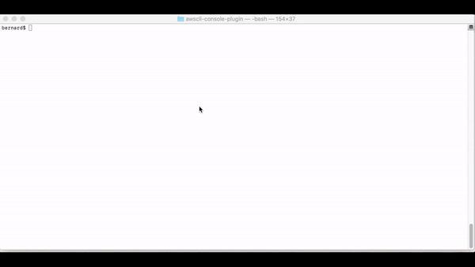

# awscli-console-plugin 
[](https://goreportcard.com/report/github.com/b-b3rn4rd/awscli-console-plugin) 
[](https://coveralls.io/github/b-b3rn4rd/awscli-console-plugin?branch=master)
[](https://github.com/b-b3rn4rd/awscli-console-plugin/actions?query=workflow%3AGo+branch%3Amaster)

AWSCLI plugin to access AWS Console using your IAM or STS credentials

# Demo

# Motivation
The following library is distributed as `awscli` plugin, but could be used a standalone tool to access AWS Console
using IAM access & secret keys or STS temporary credentials.
The code is based on the following article https://docs.aws.amazon.com/IAM/latest/UserGuide/id_roles_providers_enable-console-custom-url.html

The goal of this plugin is to simplify the authentication process to AWS Console, by providing a method to login to a given account without leaving the terminal.

# Installation
To install it as a plugin for `awscli` please follow these steps

Install `awscli-console-plugin` using `pip`, use an appropriate artifact for your OS from the release page. 
```bash
$ pip3 install https://github.com/b-b3rn4rd/awscli-console-plugin/releases/download/1.2.0/awscli-console-plugin_1.2.0_Darwin_x86_64.zip # MacOS
$ pip3 install https://github.com/b-b3rn4rd/awscli-console-plugin/releases/download/1.2.0/awscli-console-plugin_1.2.0_Linux_x86_64.zip # Linux
$ pip3 install https://github.com/b-b3rn4rd/awscli-console-plugin/releases/download/1.2.0/awscli-console-plugin_1.2.0_Windows_x86_64.zip # Windows
```


# Configuration

Edit your `~/.aws/config` to include the following plugin definition:

If you are using the v1 AWS CLI, you can just add the plugin:

```
[plugins]
console = console

[profile auth]
region=ap-southeast-2
aws_access_key_id=AKIAXXXXXXXXXXX
aws_secret_access_key=XYXYXYYXYXYXYXYXY/ZZZZZZ
[profile dev]
role_arn=arn:aws:iam::1234567890123:role/OrganizationAccountAccessRole
region=ap-southeast-2
source_profile=auth
```

If you are using the v2 AWS CLI, you need to also specify the `cli_legacy_plugin_path`, which should
specify where your `pip` packages are installed.

```
[plugins]
cli_legacy_plugin_path = <path to your python3.7/site-packages>
console = console

[profile auth]
region=ap-southeast-2
aws_access_key_id=AKIAXXXXXXXXXXX
aws_secret_access_key=XYXYXYYXYXYXYXYXY/ZZZZZZ
[profile dev]
role_arn=arn:aws:iam::1234567890123:role/OrganizationAccountAccessRole
region=ap-southeast-2
source_profile=auth
```

 # Usage

Verify that the plugin is successfully installed
```bash
$ aws console help
NAME
       console -

DESCRIPTION
       Authenticate to AWS console

       See 'aws help' for descriptions of global parameters.

SYNOPSIS
          aws console [--profile=Name] [--timeout=Timeout] [--output-only=true|false]

OPTIONS
       --timeout  (string)  Console  session  timeout in seconds, only for IAM
       user credentials

       --output-only (boolean) Print the console url instead of opening it  in
       the browser

       See 'aws help' for descriptions of global parameters.
```

Usage Example
```bash
aws console --profile dev
```
